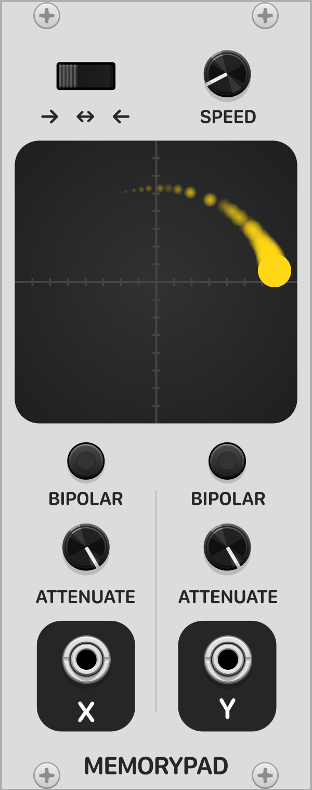

# Patina
Patina is a VCV Rack plugin. Memory Pad is the first module of the collection.

## Memory Pad
Memory Pad is a X-Y Pad LFO. Paths drawn on the touchpad are automatically recorded and repeated. Path replay speed can be adjusted. Direction can be forwards, reverse, or In-Out. Path outputs to X and Y outputs which can be set to unipolar or bipolar modes and attenuated.

To use, connect the X and Y outputs to any parameter you want modulated. Then drag the mouse on the touchpad surface to record a path. Once you let go, the path will begin repeating. Adjust speed, path direction, attenuation, and bipolar buttons to your liking. When dragging again, the previous path will be discarded and the new one will recorded.

